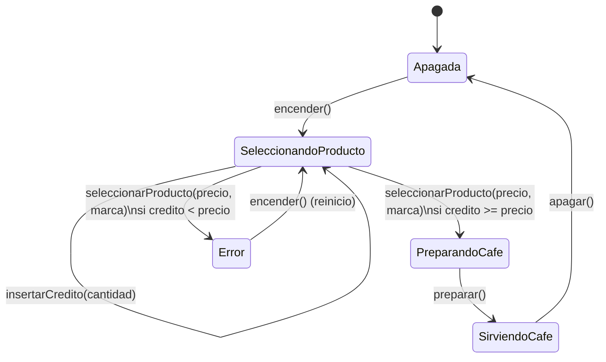

# ☕ Máquina de Café ☕

ℹ️ El proyecto **máquina de café** utiliza el **patrón máquina de estados**, con clases selladas, herencia y transiciones.

## Características 🧠

* **Clases selladas** (`sealed class`) para modelar los estados de la máquina.
* **Object** para estados sin información (`Apagada`, `SeleccionandoProducto`).
* **Data class** para estados con información adicional (`PreparandoCafe`, `SirviendoCafe`, `Error`).
* **Polimorfismo**: cada estado define qué operaciones acepta (`encender`, `insertarCredito`, `seleccionarProducto`, `apagar`).
* Gestión de **crédito**, errores y reinicio de manera segura y clara.
* Código limpio, comentado y fácilmente extensible a nuevos estados o funcionalidades.

---

## Breve explicación del código 📜

1. **`EstadoMaquinaCafe`**: clase sellada que define operaciones básicas que cada estado puede sobrescribir.
2. **Estados concretos**:

    * `Apagada`: máquina apagada, solo permite encender.
    * `SeleccionandoProducto`: permite insertar crédito y seleccionar productos.
    * `PreparandoCafe`: representa el proceso de preparación de café.
    * `SirviendoCafe`: estado final antes de apagar, muestra el recipiente y el café servido.
    * `Error`: captura errores como crédito insuficiente y permite reinicio.
3. **`MaquinaCafe`**: delega las operaciones al estado actual y mantiene el crédito.
4. **Polimorfismo y encapsulación**: cada estado maneja sus propias reglas, eliminando `when` y `if` repetitivos.
5. **Flujo de uso típico**:

    * Se enciende la máquina → se inserta crédito → se selecciona producto → se prepara → se sirve → se apaga.
    * En caso de error (crédito insuficiente), se transita al estado `Error` y se puede reiniciar.

---

## Diagrama de Estados ✨

